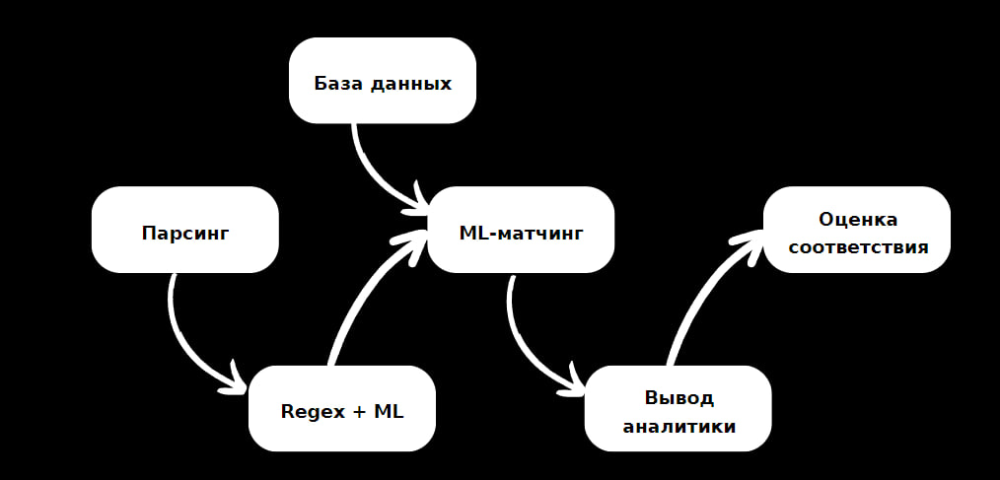

# Документ для разработки MVP: Персонализированные рекомендации образовательных курсов

---

## Термины и пояснения

- **Итерация** — совокупность всех работ, проводимых до старта очередного пилота.  
- **БТ (бизнес-требования)** — требования, определяющие основные цели проекта и ограничения.  
- **EDA (Exploratory Data Analysis)** — исследовательский анализ данных, направленный на изучение и предварительную обработку данных.  
- **Роли**:  
  - **Product Owner** — отвечает за постановку бизнес-целей, разработку требований и оценку успеха.  
  - **Data Scientist** — совмещает функции исследователя данных, ML-инженера и ML Ops-специалиста для разработки и продуктивизации моделей.  
- Распределение ролей может варьироваться в зависимости от операционной модели вашей организации.

---

## 1. Цели и предпосылки

### 1.1. Зачем идем в разработку продукта?

#### Бизнес-цель (Product Owner):  
Увеличение пользовательского потока на платформу образовательных курсов. Повышение интереса аудитории за счёт внедрения рекомендаций, что в перспективе позволит привлекать рекламу и монетизировать платформу.  

#### Почему станет лучше (Product Owner & Data Scientist):  
- Увеличится вовлечённость пользователей через персонализированные рекомендации.  
- Платформа станет инструментом карьерного роста, что усилит её конкурентоспособность.  
- Бизнес получит возможность демонстрировать аудитории актуальные курсы, стимулируя спрос.  

#### Успех итерации с точки зрения бизнеса (Product Owner):  
- Рост трафика на платформу за счёт новых пользователей.  
- Высокая удовлетворённость пользователей предложенными рекомендациями.  

---

### 1.2. Бизнес-требования и ограничения

#### Краткое описание БТ (Product Owner):  
- Автоматизация анализа вакансий с сайта HH.ru.  
- Генерация релевантных рекомендаций образовательных курсов.  
 

#### Бизнес-ограничения (Product Owner):  
- Ограничение на бюджет MVP.  
- Максимальная скорость обработки запросов.  

#### Ожидания от итерации (Product Owner):  
- Завершение тестирования MVP.  
- Подготовка базы для масштабирования функционала и интеграции рекламы.  

#### Описание бизнес-процесса пилота (Product Owner):  
- Пользователь вводит текст вакансии → система анализирует требования → выдаёт список подходящих курсов с платформы.  
- На основе рекомендаций отслеживается поведение пользователей (например, переходы на курсы).  

#### Успех пилота (Product Owner):  
- Успешное тестирование рекомендаций с валидированной точностью.  
- Готовность функционала систем для интеграции курсов разных образовательных платформ.  
- Подготовка к масштабированию решения на дополнительные источники данных.  

---

### 1.3. Что входит в скоуп проекта/итерации, что не входит

#### Входит (Data Scientist):  
- Построение базовой модели анализа вакансий.  
- Разработка MVP для тестирования рекомендаций.  
- Документирование всех процессов для дальнейшего развития.  

#### Не входит (Data Scientist):  
- Полная интеграция рекламы.  
- Детальная настройка пользовательского интерфейса.  

#### Описание результата (Data Scientist):  
- Воспроизводимое решение, готовое для масштабирования и интеграции рекламы.  

#### Технический долг (Data Scientist):  
- Оптимизация производительности.  
- Разработка модулей для расширения функционала.  

---

### 1.4. Предпосылки решения

#### Общие предпосылки (Data Scientist):  
- Данные: текст вакансий (HH.ru) и описание курсов (GeekBrains).  
- Горизонт прогноза: мгновенная выдача рекомендаций.  
- Гранулярность модели: на уровне отдельного пользователя.  

---

## 2. Методология

### 2.1. Постановка задачи (Data Scientist)  
- Построение рекомендательной системы для образовательной платформы.  
- Анализ требований вакансий и сопоставление их с описанием курсов.  

---

### 2.2. Блок-схема решения (Data Scientist)  

#### Основные этапы:  
1. **Сбор данных**:  
   - Извлечение вакансий с сайта HH.ru.  
   - Сбор информации о курсах с платформы GeekBrains.  

2. **Обработка данных**:  
   - Исследовательский анализ данных (EDA).  
   - Преобразование текстов вакансий и курсов (токенизация, векторизация).  

3. **Модель**:  
   - NLP-алгоритмы для анализа текста.  
   - Рекомендательная система на основе сопоставления данных.  

4. **Тестирование**:  
   - Проверка качества рекомендаций (точность, релевантность).  
   - Сбор обратной связи от пользователей.  

5. **Закрытие технического долга**:  
   - Оптимизация кода.  
   - Подготовка к интеграции рекламного модуля.  
6. Блок схема:

---

